---


Deep Dive into an ORM:

The Entity Framework Core Query Pipeline

---

## whoami

* Shay Rojansky
* Engineer at Microsoft, part of the Entity Framework/Data team
* Lead dev of Npgsql
  * .NET driver for PostgreSQL
  * PG provider for Entity Framework Core
* Linux guy
* Based in Berlin

---

## Intro: ORMs and C#

ORMs: can't live with them...

... can't live without them

--

## Why do we love ORMs?

Without ORMs, devs have to:

* Write SQL (without compile-time verification)
* Serialize/deserialize results (materialization)

--

## What's this talk about?

* Not a talk about new EF Core features
* Deep dive into how an ORM works
* Lots of architecture (and performance!)

Always be familiar with one layer underneath you! {.fragment}

--

## Typical ORM code

Hibernate HQL:

```java
String hql = "FROM Employee E WHERE E.id > 10 ORDER BY E.salary DESC";
```

Hibernate criteria API:

```java
Criteria crit = session.createCriteria(Product.class);
Criterion priceLessThan = Restrictions.lt("price", 10.0);
Criterion mouse = Restrictions.ilike("description", "mouse", MatchMode.ANYWHERE);
LogicalExpression orExp = Restrictions.or(priceLessThan, mouse);
crit.add(orExp);
List results=crit.list();
```

--

## ORMs in .NET

C# has LINQ (Language-Integrated Query)

```csharp
var someArray = new[] { 1, 10, 2 };
var result = someArray
    .Where(i => i > 5)
    .OrderBy(i => i)
    .Take(2)
    .ToArray();
```

These are query operators, working in-memory.

--

## IQueryable

C# allows us to use LINQ to express queries that don't run in-memory

<pre class="fragment"><code language="csharp">var employees = db.Employees
    .Where(e => e.Salary > 1000)
    .OrderBy(e => e.Salary)
    .Take(2)
    .ToArray();
</code></pre>

* Instead of evaluating, the compiler constructs an *expression tree* {.fragment}
* The expression tree can be *translated* to SQL (or something else) {.fragment}

--

## IQueryable is great! But...

* Awesome: we can use regular C# language constructs to express SQL queries
* Caveat1: we can express far more than what is translatable to SQL {.fragment}
* Caveat2: there are many mismatches between C# and SQL {.fragment}
* Caveat3: what can be expressed can't always be translated *efficiently* {.fragment}

--

## Entity Framework Core

* We had LINQ to SQL, EF6...
* EF Core 3.0 just released
  * Query pipeline got rewritten
* Unique: not just for relational databases (SQL)

<aside class="notes">
Retro talk, we stand on the shoulders of giants.
</aside>

---

## Let's Get Translating!

<aside class="notes">SQL shown is not real EF-generated SQL</aside>

--

## Null Semantics

Let's translate this:

```csharp
employees.Where(e => e.FirstName == e.LastName)
```

<div class="fragment">
To this, right?

<pre><code language="sql">SELECT ... FROM Employees WHERE FirstName = LastName</code></pre>
</div>

**Could be wrong, SQL has three-valued logic**{style=color:red} {.fragment}

<span class="fragment">In SQL, FirstName = NULL is never true... </span>
<span class="fragment">(and it ain't false either :))</span>

<aside class="notes">
Major major!
</aside>

--

## Null Semantics 2

Try to mimic C# behavior (best-effort only!)

<div class="fragment">
<pre><code lang="sql">WHERE FirstName = LastName OR
  (FirstName IS NULL AND LastName IS NULL)
</code></pre>

If one of the columns is non-nullable in the database schema, we can optimize {.fragment}

Counter-example: case-sensitivity {.fragment}

<aside class="notes">
Perf/hacks, align to natural database behavior.
</aside>

--

## Subqueries

Let's get complicated:

```csharp
employees.Where(e => e.Tasks.Count == 2)
```

<div class="fragment">
<pre><code class="sql">SELECT ...
FROM Employees AS e
WHERE (
    SELECT COUNT(*)
    FROM Tasks AS t
    WHERE t.EmployeeId = e.Id
) = 2;
</code></pre>
</div>

--

## Instance Equality

What about this?

```c#
employees.Where(e => e == e.Boss)
```

<div class="fragment">
We need to compare keys:

<pre><code class="sql">WHERE e.Id = Boss.Id</code></pre>
</div>

<div class="fragment">
The same happens if instead of a Boss we have a subquery:

<pre><code class="csharp">employees.Where(e => e.Tasks.First() == x)

WHERE (SELECT ... FROM Tasks ...).Id1 = x.Id1
</code></pre>
</div>

<aside class="notes">
Contains (check that a subordinate is my boss)
OrderBy.
</aside>

--

## More Instance Equality

Now, what happens if something has a composite key?

<div class="fragment">
<pre><code class="sql">WHERE Id1 = Boss.Id1 AND Id2 = Boss.Id2</code></pre>
</div>

<div class="fragment">
And with a subquery?

<pre><code class="csharp">employees.Where(e => e.Tasks.First() == x)</code></pre>
</div>

<div class="fragment">
<pre><code class="sql">WHERE (SELECT ...).Id1 = x.Id1 AND (SELECT ...).Id2 = x.Id2</code></pre>
</div>

<span class="fragment">**Double evaluation... Better not do this!**{style=color:red}</span>

--

## Related Instances

In C#, "related instances" are just there in memory.

<div class="fragment">
With DB, we need to fetch only what's needed:

<pre><code language="csharp">employees.Include(b => b.Tasks)</code></pre>
</div>

<div class="fragment">
<pre><code language="sql">SELECT ...
FROM Employees AS e
LEFT JOIN Tasks AS t ON e.Id = t.EmployeeId
ORDER BY e.Id, t.Id
</code></pre>
</div>

* Previous versions of EF Core translated this with multiple queries {.fragment}
  * Multiple roundtrips vs. "cartesian explosion"
  * Transactionality

<aside class="notes">
Manual ways to split apart the query to multiple ones.
</aside>

--

## Lessons Learned

* There are many, many mismatches between C# LINQ and SQL
* ORMs need to make decisions about how to translate {.fragment}
* We need to do many things to expression trees before they can be converted {.fragment}

---

## Expression Trees and Visitors

--

## Query Pipeline: Inputs and Outputs

* Input: LINQ expression tree (from IQueryable)
* Outputs (for relational)?
  * SQL {.fragment}
  * Shaper / materializer, to read results (DbDataReader) {.fragment}
* We are building a compiler! {.fragment}

--

## Our Input: Expression Trees

```csharp
Func<int, bool> comparer = num => num < 5;
```

<div class="fragment">
<pre><code language="csharp">Expression&lt;Func&lt;int, bool&gt;&gt; comparerExpression
   = num => num < 5;
Func&lt;int, bool&gt; compiled = comparerExpression.Compile();
</code></pre>
</div>

<pre class="fragment"><code language="csharp">var numParam = Expression.Parameter(typeof(int), "num");

Expression&lt;Func&lt;int, bool&gt;&gt; comparerExpression2 =
    Expression.Lambda&lt;Func&lt;int, bool&gt;&gt;(
        Expression.LessThan(
            numParam,
            Expression.Constant(5)),
        numParam);

var compiled2 = comparerExpression2.Compile();
</code></pre>



--

## Expression Trees - For Perf

* Great solution for code generation
* Generate specific, tailored lambdas based on config/user input

--

## Visitors

* The query engine is architected as a pipeline of **visitors** {.fragment}
* Each visitor traverses the expression tree, responsible for doing one thing  {.fragment}

<aside class="notes">
Break down a complex task into separate components, a bit like functions.
</aside>

--

## Example Visitor

* For example, the instance equality visitor:
  * Traverses the entire tree {.fragment}
  * Identifies equality expression over instances {.fragment}
  * Replaces with equality over their keys {.fragment}

--

## Minimal Visitor Exercise

**Exercise**: optimize an expression tree, eliminating needless null checks on non-nullable database columns:

```csharp
// INPUT:
customers.Where(c => c.Age > 18 && c.Name != null)

// OUTPUT:
customers.Where(c => c.Age > 18)
```

--

<pre style="width: 1000px; height: -30px">
<code language="csharp" style="max-height: 1000px">class MyVisitor1 : ExpressionVisitor
{
    protected override Expression VisitBinary(BinaryExpression b)
    {
        var visited = (BinaryExpression)base.VisitBinary(b);

        if (b.NodeType == ExpressionType.NotEqual)
        {
            if (b.Right is ConstantExpression rightConstant &&
                rightConstant.Value == null &&
                !IsNullable(b.Left))
            {
                return Expression.Constant(true);
            }
            // TODO: Sides may be flipped!
        }

        return visited;
    }
}
</code></pre>

<pre class="fragment" style="width: 1000px; height: 500px">
<code language="csharp" style="max-height: 30px">customers.Where(c => c.Age > 18 && true)
</code></pre>

--

<pre style="width: 1000px; height: -30px">
<code language="csharp" style="max-height: 1000px">class MyVisitor2 : ExpressionVisitor
{
    protected override Expression VisitBinary(BinaryExpression b)
    {
        var visited = (BinaryExpression)base.VisitBinary(b);

        if (b.NodeType == ExpressionType.AndAlso)
        {
            if (b.Right is ConstantExpression rightConstant &&
                rightConstant.Value is bool boolValue &&
                boolValue)
            {
                return b.Left;
            }
            // TODO: Same for other side!
        }
        // TODO: Also take care of OrElse!

        return visited;
    }
}
</code></pre>

<pre class="fragment" style="width: 1000px; height: 500px">
<code language="csharp" style="max-height: 30px">customers.Where(c => c.Age > 18)
</code></pre>

--

## Recap

From this:

<pre><code language="csharp">customers.Where(c => c.Age > 18 && c.Name != null)</pre></code>

<div class="fragment">
To this:

<pre><code language="csharp">customers.Where(c => c.Age > 18 && true)</pre></code>
</div>

<div class="fragment">
To this:

<pre><code language="csharp">customers.Where(c => c.Age > 18)</pre></code>
</div>

--

## EF Core Preprocessor

<pre style="position: relative; width: 1200px; left: -100px">
<code lang="csharp">public virtual Expression Process(Expression query)
{
    query = new EnumerableToQueryableMethodConvertingExpressionVisitor().Visit(query);
    query = new QueryMetadataExtractingExpressionVisitor(_queryCompilationContext).Visit(query);
    query = new AllAnyToContainsRewritingExpressionVisitor().Visit(query);
    query = new GroupJoinFlatteningExpressionVisitor().Visit(query);
    query = new NullCheckRemovingExpressionVisitor().Visit(query);
    query = new EntityEqualityRewritingExpressionVisitor(_queryCompilationContext).Rewrite(query);
    query = new SubqueryMemberPushdownExpressionVisitor().Visit(query);
    query = new NavigationExpandingExpressionVisitor(...).Expand(query);
    query = new FunctionPreprocessingExpressionVisitor().Visit(query);
    new EnumerableVerifyingExpressionVisitor().Visit(query);

    return query;
}
</code></pre>


--

## SQL Translation

* We've been talking about LINQ methods, but... at some point we want a model of an SQL query.
* Instead of CLR types, methods and members, we want tables and columns.

--

<pre style="position: fixed; top: 0; left: 100px">
<code lang="csharp">customers
   .Where(c => c.Name == "Joe")
   .OrderBy(c => c.Age)
   .Take(5)
   .Select(c => new { c.Name, c.Age });
</code></pre>



<div class="fragment">


<pre style="position: fixed; bottom: 80px; right: 0; width: 440px">
<code lang="sql">SELECT Name, Age FROM Customers
WHERE Age > 18
ORDER BY Age
LIMIT 10
</code></pre>
</div>

<aside class="notes">
SelectExpression has tables which have columns. All these are references.
</aside>

--

## SQL Translation 2

Still expressions, but now custom SQL ones!

```c#
customers.Where(c => new[] { 1, 2, 3 }.Contains(c.Id));

// Becomes:
WHERE c.ID IN (1, 2, 3) // This is an SqlInExpression
```

Expression trees can have custom expression types

--

## Provider and User Translations

```csharp
customers.Where(c => c.Name.Length > 5)

// Becomes:
WHERE LEN(c.Name) > 5    // On SqlServer
WHERE LENGTH(c.Name) > 5 // On PostgreSQL
```

Users can define functions which render into arbitrary SQL expressions {.fragment}

--

## End of the Line

* Some more postprocessing after SQL translation
* QuerySqlGenerator is just another visitor, outputs an SQL string
* Another visitor code-generates the shaper

--

## Query Pipeline Overview



---

## Let's talk about Performance

--

## Compilation is Slow

* No way we run all these visitors each time
* The answer is always, always... caching. {.fragment}

--

## Zoom out Again



<div class="fragment">
Cool! However, for each query, we still do:

* Some magic called parameter extraction
* Cache key hashcode calculation
* Structural comparison with trees in the query cache
</div>

<aside class="notes">
Pretty cool, compilation isn't perf sensitive and we can concentrate on a good clean design.
</aside>

--

## Compiled Queries

```csharp
using (var ctx = new MyContext())
{
    var id = 8;
    var posts = ctx.Posts.Single(p => p.Id == id);
}
```

<pre class="fragment"><code language="csharp">
// Create an explicitly compiled query
private static Func&lt;MyContext, int, Post&gt; _postById
    = EF.CompileQuery((MyContext ctx, int id) =>
        ctx.Posts.Single(p => p.Id == id));

// Use the compiled query by invoking it
using (var ctx = new MyContext())
{
   var post = _postById(ctx, 8);
}
</code></pre>

---

## Closing Words

* Everybody loves ORMs
* ... and everybody hates ORMs {.fragment}
* Writing an ORM is... complex :) {.fragment}
* Being aware of what happens under the hood is always important. {.fragment}
* *Always* check the SQL being generated! {.fragment}

---

## Actual Heroes

**Smit Patel**

(new query pipeline architect)

**Maurycy Markowski**

(another big query guy)

**And of course ... the rest of the EF team**

---

## Thank you!

**Shay Rojansky**, <http://roji.org>, @shayrojansky


---